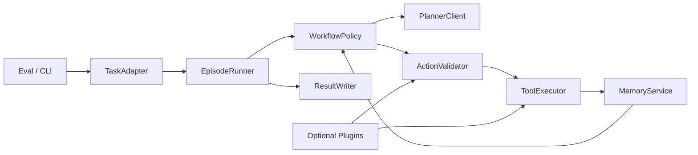

# TierNav 工程重构计划

> 目标：只从工程和技术角度重构整体架构、接口、工作流程和功能边界，不讨论学术效果。

## 1. 背景

当前代码已经把 AEQA / GOATBench / Two-Tier / Legacy 多条路径放在一起，能跑，但存在典型的工程问题：

- 运行时职责分散，主流程、策略、工具、记忆、日志混在多个层级。
- 默认工具注册表里混入 stub。
- Provider / Graph / Node 的契约不够统一。
- 输出格式和回退逻辑仍有历史包袱。
- 部分“完成”能力只实现了骨架，默认路径可达性不够干净。

这次重构不做局部修补，做的是**架构收口**。

## 2. 重构目标

1. 一个主运行时：所有任务都走同一套 `EpisodeRunner`。
2. 一个状态契约：禁止各处直接拼散乱 `dict`。
3. 一个工作流策略层：预算、终止、fallback、stall 统一处理。
4. 一个工具契约层：工具注册、参数、返回值、终态统一。
5. 一个任务适配层：AEQA / GOATBench 差异只留在 Adapter。
6. 一个输出契约层：结果、轨迹、日志、评测产物统一出口。
7. 默认路径零 stub：实验能力只能 opt-in。

## 3. 非目标

- 不做学术算法升级。
- 不做 benchmark tuning。
- 不追求一次性重写全部历史代码。
- 不在默认路径保留 `NotImplementedError` 的可达分支。

## 4. 目标架构

### 4.1 运行时分层

- `contracts`: `EpisodeRequest` / `EpisodeState` / `PlannerDecision` / `ToolResult` / `EpisodeResult`
- `orchestrator`: `EpisodeRunner`
- `policy`: budget / stall / submit / fallback / retry
- `adapters`: AEQA / GOATBench
- `services`: Planner / Tools / Memory / Writer
- `plugins`: 仅承载实验能力

## 5. 关键架构决策

### ADR-001: 单一运行时
把 `EpisodeRunner` 设为唯一业务驱动器，LangGraph 只负责编排，不再承载业务分支。

### ADR-002: 任务适配分离
AEQA / GOATBench 的差异放进 `TaskAdapter`，避免在核心流程里塞任务特判。

### ADR-003: 稳定能力与实验能力分离
`critic`、`fork_subagent`、`pixel_navigate` 这类能力默认不进入稳定主链路，只能通过显式配置启用。

### ADR-004: 统一结果契约
所有入口统一输出 `EpisodeResult`，不允许不同入口返回字段漂移。

### ADR-005: 默认路径不接 stub
默认 registry 只保留稳定工具；stub 必须迁到 plugin 或直接删除。

## 6. 现状问题映射

| 问题 | 影响模块 | 重构方向 |
|---|---|---|
| stub 工具进入默认注册表 | `src/two_tier_graph/tools.py`, `src/two_tier_graph/fork.py` | 默认 registry 只注册稳定工具 |
| provider 返回契约不够稳 | `src/two_tier_graph/providers.py`, `src/two_tier_graph/nodes.py` | 引入显式 `PlannerDecision` / error result |
| stall / fallback / verify 路由分散 | `src/two_tier_graph/edges.py`, `src/two_tier_graph/nodes.py` | 收口到 `WorkflowPolicy` |
| 输出格式和日志分散 | `src/logger_aeqa.py`, `src/logger_goatbench.py`, `run_*_evaluation.py` | 统一 `ResultWriter` |
| graph 编排承担过多业务 | `src/two_tier_graph/graph.py`, `entrypoint.py` | 迁移到 `EpisodeRunner` + Adapter |
| 记忆层接口混杂 | `src/agent_memory.py`, `src/agent_notebook.py`, `src/two_tier_graph/visual_memory.py` | 统一 `MemoryService` |

## 7. 分期计划

### Phase 0: 冻结基线

目标：
- 固定当前行为基线。
- 记录可复现的本地单测结果。
- 远端 smoke 的执行边界先明确。

动作：
- 本地使用 `3dmem` conda 环境跑 `pytest`。
- 远端 smoke 只在指定 SSH 服务器执行。
- 固化当前输出 schema 和关键回归测试。

验收：
- 能明确区分“历史缺陷”和“重构引入缺陷”。

### Phase 1: 契约层重写

目标：
- 建立统一的数据契约。
- 消灭跨模块裸 `dict` 依赖。

动作：
- 引入 `EpisodeState` / `EpisodeResult` / `PlannerDecision` / `ToolResult`。
- 统一序列化与反序列化。
- 明确每个契约的所有者和字段语义。

验收：
- 核心流程可以只靠契约对象流转。

### Phase 2: 工作流收口

目标：
- 让运行时只有一个主循环。

动作：
- 新建 `EpisodeRunner`。
- 把预算、stall、submit、fallback 全部移入 `WorkflowPolicy`。
- AEQA / GOATBench 通过 Adapter 注入任务差异。

验收：
- 任务差异不再污染核心流程。

### Phase 3: 工具与 Provider 收口

目标：
- 工具和模型调用都变成稳定接口。

动作：
- 清理默认 registry 中的 stub。
- 将实验性工具改为插件。
- 统一 provider 的返回和错误处理。

验收：
- 默认路径没有可达 stub。

### Phase 4: 记忆、日志、输出统一

目标：
- 结果写出和运行时解耦。

动作：
- 合并结果写出逻辑。
- 统一 trace / metrics / episode result。
- 记忆层只暴露稳定服务接口。

验收：
- 不同入口写出的结果字段一致。

### Phase 5: 下线旧路径

目标：
- 删除重复实现，保留兼容外壳。

动作：
- 逐步减少 `agent_workflow.py` / `two_tier_graph` 中的重复逻辑。
- 清理死代码和历史 stub。

验收：
- 默认执行路径只保留一套实现。

## 8. 测试策略

### 本地

- 环境：`3dmem`
- 用途：单元测试、契约测试、轻量回归
- 命令：`/home/afdsafg/miniconda3/envs/3dmem/bin/python -m pytest`

### 远端 smoke

- 仅允许在指定 SSH 服务器运行。
- 用途：真实场景 / 任务级烟测。
- 需要先同步仓库，再执行 smoke。

### 测试优先级

1. 契约测试
2. 工作流路由测试
3. 工具注册与 fallback 测试
4. 远端 smoke

## 9. 主要风险

| 风险 | 影响 | 缓解 |
|---|---|---|
| 契约切换牵一发而动全身 | 中高 | 先加适配层，再替换调用点 |
| stub 混入默认路径 | 高 | 默认 registry 收口，实验能力显式开关 |
| 本地和远端环境不一致 | 中 | 本地只做单测，远端只做 smoke |
| 旧接口回归失真 | 中 | 保留兼容层和 golden 测试 |

## 10. 下一步执行顺序

1. 冻结基线测试和输出 schema。
2. 定义统一契约。
3. 抽出 `EpisodeRunner` / `WorkflowPolicy`。
4. 收口 provider / tool / memory。
5. 删除默认路径 stub。
6. 远端 smoke 验证。

