# TierNav Runtime 重构设计

## 1. 目标

本次重构的目标不是修补单个模块，而是把 TierNav 变成一个适合研究、消融和复现实验的导航 agent runtime。

核心原则：

- `LangGraph` 是唯一执行 backend。
- `Pydantic / JSON Schema` 是唯一契约来源。
- 运行时必须支持连续上下文、可回放、可恢复、可消融。
- 默认路径不允许再有可达 stub。
- 设计上借鉴 Claude Code 的成熟工程机制，但不复制其产品形态。

## 2. 研究贡献与消融轴

这个 runtime 只围绕三个核心贡献组织：

1. 状态机 + 连续上下文的 agent
2. 房间 - 快照 - 物体三层时空场景图记忆库
3. 主动记忆查询与复用机制

消融实验主要围绕这三个轴展开，其他能力（如 stall recovery、critic、额外工具）都应被视为工程辅助能力，不进入论文主贡献叙事。

## 3. 非目标

- 不做多 backend 竞争框架。
- 不保留默认路径中的 stub 工具。
- 不继续让 AEQA / GOATBench 逻辑污染核心执行流程。
- 不把业务状态继续散落在裸 `dict` 里。
- 不把实验能力和稳定能力混在同一个默认链路里。

## 4. 非功能要求

### 可复现性
- 同一 `RunSpec` + 同一随机种子 + 同一模型版本，应能回放到同一份事件序列。
- 所有中间状态必须能从事件日志重建。

### 可扩展性
- 新任务只能通过 `TaskAdapter` 接入。
- 新工具只能通过注册表和显式启用接入。
- 新记忆层必须有独立契约，不得直接侵入执行流程。

### 可观测性
- 每一步都要有事件记录。
- 每次上下文编译、工具调用、记忆查询都要可追踪。
- 每次消融开关变化都要进入运行记录。

### 性能
- 上下文编译、记忆查询、事件落盘都必须是轻量操作。
- 长时程 episode 不能依赖一次性大对象堆积在内存里。

## 5. 总体架构

```mermaid
flowchart LR
  CLI[CLI / Batch / Eval] --> EXP[ExperimentSpec]
  EXP --> ADP[TaskAdapter]
  ADP --> RT[LangGraph Runtime]

  subgraph CORE[Runtime Core]
    C1[Contracts\nPydantic / JSON Schema]
    C2[ContextCompiler\ncacheable + dynamic sections]
    C3[WorkflowPolicy\nbudget / stall / fallback / verify]
    C4[PlannerClient\nClaude / OpenAI / other models]
    C5[ToolRegistry + ToolExecutor]
    C6[MemoryService\nscene graph + history + hypotheses]
    C7[Recorder / Replay / Metrics]
  end

  RT --- C1
  RT --- C2
  RT --- C3
  RT --- C4
  RT --- C5
  RT --- C6
  RT --- C7

  C7 --> LOG[(Append-only Episode Log)]
  C6 --> MEM[(Memory Index / Materialized Views)]
  C2 --> CACHE[(Prompt Cache)]
  C7 --> RES[EpisodeResult + Artifacts]
```

### 设计解释

- `LangGraph Runtime` 负责执行图，不负责承载零散业务逻辑。
- `WorkflowPolicy` 负责决定下一步该走哪里，但它是纯逻辑层，易测。
- `ContextCompiler` 负责把记忆、历史、当前观测拼成模型输入，并做缓存分层。
- `MemoryService` 负责时空场景图和主动查询，不负责直接决定策略。
- `Recorder / Replay / Metrics` 负责把研究工作变成可回放、可对照、可消融的数据。

## 6. 核心契约

所有跨模块边界都使用 Pydantic 模型，并生成 JSON Schema。

### 6.1 `RunSpec`
定义一次实验的完整配置：

- 任务类型
- 数据集 split
- 模型与 provider
- budgets
- 消融开关
- 输出目录
- 随机种子

### 6.2 `EpisodeRequest`
定义一次 episode 的输入：

- scene / question / goal metadata
- 任务适配后的任务描述
- 初始观测与约束

### 6.3 `EpisodeState`
定义 runtime 的可变状态：

- 当前轮次、步数、预算
- 当前动作、最新观测、终止标记
- 连续上下文摘要
- 当前记忆索引
- 当前政策判断

### 6.4 `EpisodeEvent`
定义 append-only 事件：

- `episode_started`
- `context_compiled`
- `plan_selected`
- `tool_called`
- `tool_result_received`
- `memory_updated`
- `policy_transitioned`
- `episode_ended`

### 6.5 `EpisodeResult`
定义对外输出：

- 最终答案 / 目标到达结果
- 成功标记
- 步数 / 轮次 / 路径长度
- 关键事件摘要
- 产物路径

### 6.6 约束

- 公共接口不接受裸 `dict`。
- 所有对象必须可序列化。
- 契约版本必须显式写入事件和结果。

## 7. 组件设计

### 7.1 `TaskAdapter`
职责：

- 把 AEQA / GOATBench 的任务差异翻译成统一的 `EpisodeRequest`
- 把统一 `EpisodeResult` 翻译回各自评测所需格式

原则：

- 任务差异只存在于 adapter。
- 核心 runtime 不知道 AEQA 和 GOATBench 的细节。

### 7.2 `LangGraph Runtime`
职责：

- 执行 episode 图
- 维护 state
- 调用 policy / planner / tools / memory / recorder

推荐节点分层：

1. `bootstrap`
2. `compile_context`
3. `plan`
4. `policy_check`
5. `execute_tool`
6. `observe`
7. `update_memory`
8. `finalize`

说明：

- 图是主流程，不是壳。
- `policy_check` 是条件边与决策边界的统一位置。
- `finalize` 统一写出结果，不允许各处自己收尾。

### 7.3 `ContextCompiler`
职责：

- 生成模型输入的分层上下文
- 管理 cacheable / dynamic section
- 做上下文压缩与重组

借鉴 Claude Code 的做法：

- 静态部分先缓存
- 动态部分每轮更新
- 上下文边界明确
- 压缩失败时有降级策略

建议的 section：

- `task_instruction`
- `action_schema`
- `memory_index`
- `recent_trace`
- `current_observation`
- `policy_hint`

### 7.4 `PlannerClient`
职责：

- 统一封装 Claude / OpenAI / 其他模型调用
- 返回统一的 `PlannerDecision`
- 对输入输出做 schema 验证

说明：

- `LangGraph` 是唯一执行 backend。
- `PlannerClient` 只是模型调用抽象，不改变 runtime 形态。

### 7.5 `WorkflowPolicy`
职责：

- budget 管理
- stall 检测与恢复
- submit / fallback / retry
- 消融开关路由

原则：

- 策略必须是纯函数化、可单测。
- 策略不直接读写复杂外部对象。

### 7.6 `ToolRegistry` / `ToolExecutor`
职责：

- 统一注册稳定工具
- 统一执行工具并返回结构化结果
- 禁止默认路径进入 stub

规则：

- 默认 registry 只包含稳定工具。
- 实验性工具必须显式启用。
- 任何 `NotImplementedError` 都不能留在默认链路里。

### 7.7 `MemoryService`

这是本设计的第二个核心。

记忆不是一堆文本摘要，而是一张可查询、可复用、可回放的时空图。

建议分四层：

1. 房间层
   - room 节点、连接关系、访问状态、拒绝状态

2. 快照层
   - 每个观测快照都是证据节点
   - 与房间、时间、动作相连

3. 物体层
   - 物体类别、实例、属性、置信度、证据来源

4. 计划 / 假设层
   - 探索历史
   - 候选假设
   - 当前计划
   - 反证与淘汰理由

查询机制：

- 任务驱动查询
- 房间驱动查询
- 物体驱动查询
- 证据链查询
- 假设驱动查询

返回结果不是原始数据，而是 `MemoryPack`：

- 应该注入到上下文的摘要
- 相关证据
- 支持 / 反证
- 置信度
- 复用建议

### 7.8 `Recorder / Replay / Metrics`

职责：

- 追加事件日志
- 生成 materialized state
- 支持重放和对照
- 汇总指标和实验产物

借鉴 Claude Code 的 append-only transcript 思路：

- 原始日志只追加，不原地改写
- 状态由日志重建
- 结果由日志派生

## 8. 数据流

1. `CLI` 读取 `RunSpec`
2. `TaskAdapter` 生成 `EpisodeRequest`
3. `LangGraph Runtime` 初始化 `EpisodeState`
4. `ContextCompiler` 构建分层上下文
5. `PlannerClient` 输出 `PlannerDecision`
6. `WorkflowPolicy` 判断是否继续、终止、回退或重试
7. `ToolExecutor` 执行动作
8. `MemoryService` 更新时空图和历史图
9. `Recorder` 写入事件和指标
10. `finalize` 输出 `EpisodeResult`

### 回放

- 读取 append-only event log
- 重建 `EpisodeState`
- 重建 memory materialized view
- 重建当时的上下文编译结果
- 验证同配置下的行为一致性

### 消融

所有消融只改 `RunSpec`，不改核心代码路径：

- 关闭连续上下文
- 关闭时空记忆图
- 关闭主动查询与复用
- 关闭压缩缓存
- 关闭 stall recovery

## 9. 借鉴 Claude Code 的机制

这里借鉴的是工程方法，不是产品功能。

### 上下文管理
- 参考 `claude-code-analysis/analysis/04f-context-management.md`
- 做法：固定边界、分层压缩、失败降级、保留关键状态

### Prompt 管理
- 参考 `claude-code-analysis/analysis/04g-prompt-management.md`
- 做法：section 化、cacheable / dynamic 分离、明确缓存边界

### Session 存储与恢复
- 参考 `claude-code-analysis/analysis/04i-session-storage-resume.md`
- 做法：append-only 日志、可恢复、可重放、可审计

### 多 agent 的工程思想
- 参考 `claude-code-analysis/analysis/04h-multi-agent.md`
- 做法：只吸收“边界清晰、职责拆分、显式调度”的思想
- 不把多 agent 作为默认执行链路

### Pred-EQA 的启发

根据你在 `/home/afdsafg/下载/new/Pred-EQA` 的实验结论，主动记忆查询和复用确实值得作为独立能力保留。

本设计把这部分抽象成：

- 记忆查询是显式服务
- 查询结果是结构化 `MemoryPack`
- 记忆复用要可消融、可回放、可统计

## 10. 关键决策

### ADR-001: LangGraph 作为唯一执行 backend

**Decision**: 只保留 LangGraph 执行路径。

**Why**:
- 保持控制流显式
- 更适合研究可解释性和消融
- 更容易把 policy / memory / replay 固化成图内边界

**Alternatives**:
- 纯 runner 模式
- 多 backend 并行

### ADR-002: Pydantic / JSON Schema 作为唯一契约

**Decision**: 所有跨模块数据都用 Pydantic 模型，并导出 JSON Schema。

**Why**:
- 统一校验
- 易做 artifact 检查
- 易做跨模块和跨语言对接

**Alternatives**:
- 裸 dataclass
- 裸 dict

### ADR-003: Append-only event log + materialized state

**Decision**: 事件日志是 source of truth，状态是 materialized view。

**Why**:
- 便于 replay
- 便于审计
- 便于 ablation

**Alternatives**:
- 只保留 mutable state
- 只保留最终结果

### ADR-004: 记忆系统以 room-snapshot-object 为主

**Decision**: 记忆核心是空间图，不是纯文本摘要。

**Why**:
- 更贴合具身导航
- 更容易做主动查询和复用
- 更容易解释探索行为

**Alternatives**:
- 纯向量检索
- 纯文本 notebook

### ADR-005: 默认路径不包含 stub

**Decision**: 默认 registry 只保留稳定能力。

**Why**:
- 避免研究框架里混入假完成能力
- 提升可维护性和可测试性

**Alternatives**:
- 把 stub 保留在默认路径
- 通过运行时分支隐藏 stub

## 11. 风险与对策

| 风险 | 影响 | 对策 |
|---|---|---|
| 契约膨胀 | 维护困难 | schema version + 严格边界 |
| 记忆图过复杂 | 查询慢、难调试 | 先做单一 canonical graph |
| 上下文缓存失效 | 结果漂移 | section hash + 强制重编译 |
| 日志过大 | 存储压力 | 事件压缩 + checkpoint |
| provider 差异 | 行为不一致 | planner schema conformance tests |
| adapter 污染核心 | 研究不可比 | 任务逻辑只允许在 adapter 内 |

## 12. 验证策略

### 契约测试
- Pydantic 模型可序列化
- JSON Schema snapshot 稳定
- 版本升级兼容性测试

### Graph 测试
- 路由测试
- 预算 / stall / fallback 测试
- 终止条件测试

### 记忆测试
- room / snapshot / object 三层查询
- 复用 pack 的注入位置
- 查询失败降级

### 回放测试
- 同一事件日志可重建同一状态
- 同一输入可恢复到相同的可观测结果

### 消融测试
- 三个主贡献分别开关
- 组合消融矩阵
- 记录性能和成功率差异

## 13. 结论

这个 runtime 的最终形态应该是：

- 一个图驱动的导航 agent
- 一套统一契约
- 一张可查询的空间记忆图
- 一条可回放的事件链
- 一组面向研究的消融开关

这会让 TierNav 的核心价值更清楚：不是“又一个能跑的 agent”，而是“一个可研究、可复现、可扩展的具身导航 runtime”。

