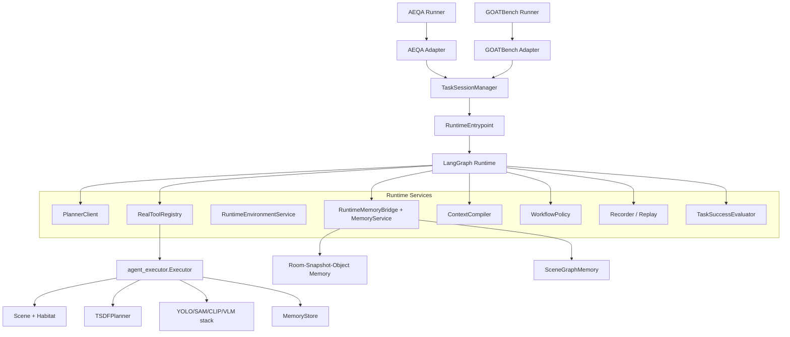

# TierNav Runtime Habitat Integration Design

## 1. Decision

Use the new `src/tiernav_runtime/` package as the only real execution runtime for AEQA and GOATBench experiments.

The old `legacy` hand-written loop and old `langgraph` state ports will be preserved as backups, but removed from the default import path and runner engine choices. The new runtime will keep the graph-first, Pydantic-contract architecture and integrate real Habitat, TSDFPlanner, Executor, VLM, and scene-graph services through explicit runtime service adapters.

This is an intentional compatibility break. The supported execution engine after cutover is `runtime`.

## 2. Sources Reviewed

The design is based on the current TierNav runtime worktree and the local benchmark repositories requested by the user.

TierNav files reviewed:

- `src/tiernav_runtime/contracts.py`
- `src/tiernav_runtime/graph.py`
- `src/tiernav_runtime/entrypoint.py`
- `src/tiernav_runtime/tools.py`
- `src/tiernav_runtime/memory.py`
- `src/tiernav_runtime/context.py`
- `src/agent_executor.py`
- `src/agent_planner.py`
- `src/agent_workflow.py`
- `src/two_tier_graph/entrypoint.py`
- `src/goatbench_graph/entrypoint.py`
- `run_two_tier_aeqa_evaluation.py`
- `run_goatbench_evaluation.py`
- `run_goatbench_two_tier_evaluation.py`
- `cfg/eval_aeqa.yaml`
- `cfg/eval_goatbench.yaml`

OpenEQA files reviewed:

- `/home/afdsafg/下载/new/open-eqa/README.md`
- `/home/afdsafg/下载/new/open-eqa/data/README.md`
- `/home/afdsafg/下载/new/open-eqa/data/open-eqa-v0.json`
- `/home/afdsafg/下载/new/open-eqa/evaluate-predictions.py`
- `/home/afdsafg/下载/new/open-eqa/openeqa/evaluation/llm_match.py`
- `/home/afdsafg/下载/new/open-eqa/paper.pdf`

GOATBench files reviewed:

- `/home/afdsafg/下载/new/goat-bench/README.md`
- `/home/afdsafg/下载/new/goat-bench/2404.06609v1.pdf`
- `/home/afdsafg/下载/new/goat-bench/goat_bench/task/goat_task.py`
- `/home/afdsafg/下载/new/goat-bench/goat_bench/measurements/nav.py`
- `/home/afdsafg/下载/new/goat-bench/goat_bench/dataset/goat_dataset.py`
- `/home/afdsafg/下载/new/goat-bench/config/tasks/goat_stretch_hm3d.yaml`

## 3. Benchmark Contracts

### 3.1 AEQA / OpenEQA

OpenEQA defines EQA as understanding an environment well enough to answer open-vocabulary natural-language questions. The dataset provides question-answer pairs and episode histories. The official evaluation consumes a result list keyed by `question_id` and scores each predicted answer using LLM-Match.

TierNav uses the active EQA setting:

- One question is one independent episode.
- The runtime starts from the question's scene and start pose.
- The agent may explore before producing a final natural-language answer.
- The output is an answer string plus trace metrics.
- Memory must not persist across AEQA questions.
- The scene graph and memory store are episode-local.
- Correctness is evaluated by answer quality, not by reaching a target point.

The runtime must still record path length and step counts because OpenEQA A-EQA also considers efficiency. However, the terminal success signal for the runtime is answer submission; official correctness remains external LLM-Match.

### 3.2 GOATBench

GOATBench defines a multi-modal lifelong navigation task. One episode contains 5 to 10 sequential subtasks. A subtask goal can be specified as an object category, a language description, or an image identifying a target instance.

TierNav uses the project-local experimental success radius from `cfg/eval_goatbench.yaml`:

- `success_distance: 1.0`

Runtime contract:

- One GOATBench episode owns one long-lived runtime session.
- Each subtask is represented as a runtime episode request inside that session.
- Scene, TSDFPlanner, pose, notebook, and spatial memory persist across subtasks in the same GOATBench episode.
- Memory resets between GOATBench episodes.
- A subtask is successful only when the agent explicitly submits/stops and the geometric target-distance check is within `success_distance` meters.
- A planner's text claim that it arrived is not sufficient.
- The final pose of subtask `k` becomes the start pose of subtask `k+1`.
- GOATBench result payloads must expose per-subtask success, distance, SPL/path-length fields, and enough trace data for analysis.

The official GOATBench paper describes a 1 meter success condition. The official codebase has config variants that can use smaller radii, but this TierNav experiment uses 1 meter because the local evaluation config and user requirement both specify 1 meter.

## 4. Goals

1. Make `tiernav_runtime` the only real execution backend for AEQA and GOATBench.
2. Preserve old runtime code through Git backup and source archive, without keeping it as a selectable default path.
3. Replace fake/noop runtime tools with real Habitat-backed tools for production runs.
4. Keep deterministic fake services for unit tests and replay tests.
5. Keep task-specific behavior in adapters and session managers, not in core graph nodes.
6. Support the three research contributions:
   - State-machine agent with continuous context.
   - Room-snapshot-object spatial scene graph plus exploration history and hypotheses.
   - Active memory query and reuse.
7. Make ablation switches reliable and testable for AEQA and GOATBench.

## 5. Non-Goals

- Do not retain `legacy` and old `langgraph` as runner options after cutover.
- Do not copy old state dicts into `tiernav_runtime` unchanged.
- Do not expose `fork_subagent`, `pixel_navigate`, or any stub tool in the default production registry.
- Do not implement new academic algorithms in this migration.
- Do not change the official AEQA or GOATBench scoring definitions.
- Do not use privileged goal truth for planning. Ground-truth target metadata may be used only by benchmark adapters for scoring and validation.

## 6. Architecture

Core rule: LangGraph remains the only execution backend. Habitat, TSDFPlanner, Executor, VLM, and scene graph are services called by graph nodes through contracts.

## 7. Component Design

### 7.1 Source Backup and Cutover

Before changing runtime imports:

1. Create a Git tag and branch:
   - `backup/pre-runtime-cutover-20260629`
2. Move old execution implementations into source archive:
   - `src/two_tier_graph/` to `archive/legacy_runtime/two_tier_graph/`
   - `src/goatbench_graph/` to `archive/legacy_runtime/goatbench_graph/`
3. Remove old runtime engine choices from runners.
4. Keep archived code importable only for manual inspection, not from default runners.

The archive is a source backup. It is not part of the supported runtime API.

### 7.2 Contracts

Extend runtime contracts without reintroducing loose state dicts.

New or expanded models:

- `TaskMode`
  - `question_answering`
  - `goal_navigation`
- `MemoryScope`
  - `episode`
  - `subtask_sequence`
- `BenchmarkRule`
  - `success_distance_m`
  - `requires_explicit_stop`
  - `memory_scope`
  - `scoring_mode`
- `GoalSpec`
  - `goal_type`
  - `goal_description`
  - `goal_image_id`
  - `goal_object_ids_for_scoring`
  - `subtask_index`
  - `subtask_total`
- `RuntimePose`
  - JSON-safe position and yaw/angle fields.
- `ToolMetrics`
  - `path_length_delta`
  - `num_atomic_steps`
  - `agent_target_distance`
  - `target_arrived`
- `EpisodeResult`
  - final pose
  - snapshot counts
  - target distance
  - subtask fields for GOATBench

Contracts must distinguish planner-visible fields from scoring-only fields. Scoring-only GOAT target IDs and viewpoints must not be rendered into planner context.

### 7.3 RuntimeEnvironmentService

This service owns heavy environment objects.

Responsibilities:

- Build `Scene` for AEQA using `src.scene_aeqa.Scene`.
- Build `Scene` for GOATBench using `src.scene_goatbench.Scene`.
- Build or reset `TSDFPlanner`.
- Hold detection, SAM, CLIP, preprocess, tokenizer, cfg, and logger handles.
- Own current pose and path length.
- Expose JSON-safe pose snapshots to runtime state.
- Dispose owned scenes when the session ends.

AEQA behavior:

- Create a fresh environment per question.
- Create fresh memory and scene graph per question.
- Destroy the scene at episode end.

GOATBench behavior:

- Create one environment per benchmark episode.
- Preserve scene, TSDFPlanner, pose, memory, notebook, and scene graph across subtasks.
- Reset `tsdf_planner.max_point` and `target_point` at each subtask.
- Respect `clear_up_memory_every_subtask`; default local config is false.

### 7.4 PlannerClient

Wrap the existing `src.agent_planner.Planner` behind the runtime interface.

Responsibilities:

- Accept the compiled context string.
- Call the configured model provider.
- Validate and normalize the response into `PlannerDecision`.
- Map old `PlannerAction` fields into runtime `arguments`.
- Reject malformed terminal decisions:
  - AEQA `submit_answer` must include `answer`.
  - GOATBench terminal submit must include enough target evidence for validation.

The runtime can later support Claude, OpenAI, or other agent SDK clients here without changing graph topology.

### 7.5 RealToolRegistry

Production tools wrap `src.agent_executor.Executor`.

Default production tools:

- `explore_panorama`
- `navigate_to_object`
- `explore_seed`
- `explore_frontier`
- `submit_answer`

Each tool returns `ToolResult` with:

- structured `Observation`
- path-length delta
- pose update
- snapshot IDs
- object IDs
- room ID
- terminal flag
- error string instead of exceptions for recoverable failures

AEQA terminal behavior:

- `submit_answer` finalizes the answer.
- Runtime success means a valid answer was submitted; official quality is measured later by LLM-Match.

GOATBench terminal behavior:

- `submit_answer` means the agent claims it reached the goal.
- The tool or success evaluator checks distance against `success_distance_m`.
- If the distance is above threshold, the subtask ends as failure or continues according to policy. The first implementation should end the subtask as failure on explicit terminal submit outside the radius, because GOATBench stop is a terminal action.

### 7.6 RuntimeMemoryBridge

The existing `MemoryStore`, `EvidenceNotebook`, and `SceneGraphMemory` contain useful behavior. The new runtime should not discard them, but should not let them define control flow.

Responsibilities:

- Convert `TrajectoryEvidence` into runtime `Observation`.
- Update the new `MemoryService` room-snapshot-object graph.
- Keep `SceneGraphMemory` synchronized from TSDF room segmentation.
- Add exploration decisions and outcomes as memory events.
- Add hypothesis support and contradiction records when planner decisions cite evidence.
- Expose active memory query packs to `ContextCompiler`.

Memory scope:

- AEQA: memory scope is `episode`; reset on every question.
- GOATBench: memory scope is `subtask_sequence`; persist through all subtasks of one episode.
- Cross-dataset memory is not allowed.

### 7.7 TaskSessionManager

The session manager is the boundary between benchmark runners and runtime services.

AEQA:

- Build one `RunSpec` and one `EpisodeRequest` per question.
- Use a new environment session per question.
- Write one result payload per `question_id`.

GOATBench:

- Build one long-lived session per GOAT episode.
- Build one `EpisodeRequest` per subtask.
- Reuse services across subtasks.
- Thread final pose, memory, scene graph, and cross-subtask notes.
- Aggregate subtask results into GOATBench logger output.

### 7.8 TaskSuccessEvaluator

Success logic must be explicit and benchmark-specific.

AEQA evaluator:

- Runtime terminal condition: answer submitted or budget fallback.
- Runtime `success` means an answer string exists and no runtime error occurred.
- Official correctness is external LLM-Match and must not be faked inside runtime.

GOATBench evaluator:

- Compute current agent distance to goal using the same local helper path currently used by the runner, `calc_agent_subtask_distance`, or an equivalent service wrapper.
- Use `cfg.success_distance`, defaulting to `1.0` in the local GOATBench config.
- Require explicit terminal submit/stop.
- Produce `success_by_distance`, `agent_target_distance`, and per-subtask success fields.

## 8. Runner Design

### 8.1 AEQA Runner

`run_two_tier_aeqa_evaluation.py` becomes the supported AEQA runner.

Changes:

- Import only `run_episode_tiernav_runtime`.
- `_ENGINES` contains only `runtime`.
- `--engine` defaults to `runtime` and rejects old values.
- The runner still loads YOLO, SAM, CLIP, questions, logger, and start pose.
- The runner passes a structured request into `AEQATaskAdapter`.
- Output keeps the current JSON result shape plus `event_log_path`.

### 8.2 GOATBench Runner

Use one supported GOATBench runner after cutover. Prefer `run_goatbench_evaluation.py` because it already owns official-style dataset iteration, scene loading, logger integration, and `cfg.success_distance`.

Changes:

- Import only runtime session APIs.
- `_ENGINES` contains only `runtime`.
- For each GOAT episode, create a runtime session.
- For each subtask, create a subtask request from `GOATBenchTaskAdapter`.
- Log per-subtask success and distance through the existing GOATBench logger.
- Persist session memory across subtasks.

`run_goatbench_two_tier_evaluation.py` should be archived with old runtime code unless there is a specific reason to keep it as a thin alias. The default should avoid two competing GOATBench runners.

## 9. Event and Replay Requirements

The production runtime must record more than the current deterministic dev path.

Required events:

- `episode_started`
- `subtask_started` for GOATBench
- `context_compiled`
- `planner_called`
- `planner_decision`
- `tool_called`
- `tool_result`
- `memory_query`
- `memory_updated`
- `success_evaluated`
- `episode_ended`

Event payloads must be JSON-safe. Heavy objects stay in services and never enter graph state or event logs.

Replay target:

- Unit replay reconstructs state transitions and final result.
- Production replay need not reconstruct Habitat or images, but must reconstruct decisions, observations, memory summaries, and success decisions.

## 10. Error Handling

Initialization errors:

- Return a structured failed `EpisodeResult`.
- Include `failure_type="initialization_error"`.
- Ensure owned scenes are cleaned up.

Tool errors:

- Recoverable tool errors return `ToolResult(ok=False, error=...)`.
- Nonrecoverable exceptions are caught at the graph boundary and written to event log.

Planner errors:

- Invalid JSON or invalid schema becomes a structured planner failure.
- Policy may retry once if configured.
- Otherwise fallback finalizes with `failure_type="planner_error"`.

GOATBench scoring errors:

- If distance cannot be computed, subtask result is failure with `failure_type="distance_error"`.
- Do not mark success from snapshot presence alone.

Append-only event logs:

- Keep the existing behavior that rejects overwriting an existing event log.
- Runners must create unique output directories or explicitly clean old outputs outside runtime.

## 11. Testing Strategy

Unit tests:

- Contracts validate AEQA and GOATBench benchmark rules.
- Fake environment service verifies memory scope reset/persist behavior.
- Fake executor tools verify pose and path metrics.
- Planner adapter validates legacy `PlannerAction` conversion.
- Success evaluator tests:
  - AEQA answer terminal.
  - GOATBench explicit stop inside 1m succeeds.
  - GOATBench explicit stop outside 1m fails.
  - GOATBench no explicit stop cannot succeed.

Integration tests with fakes:

- AEQA one-question fake run writes answer and event log.
- GOATBench fake episode with two subtasks preserves memory and threads pose.

Production smoke tests:

- AEQA 1 to 2 questions from `cfg/eval_aeqa.yaml`.
- GOATBench one scene, one episode, one split from `cfg/eval_goatbench.yaml`.

Regression gates:

- `tests/runtime -q` must pass.
- Archived legacy tests are not part of the default gate.
- A small import audit must prove default runners do not import `archive/legacy_runtime`.

## 12. Migration Sequence

1. Create Git backup tag and branch.
2. Archive old runtime source directories.
3. Extend contracts for benchmark rules, pose, goal specs, and memory scope.
4. Add runtime environment service with fake tests first.
5. Add planner client wrapper.
6. Add real tool registry wrapping `Executor`.
7. Add memory bridge from `TrajectoryEvidence` to runtime `Observation`.
8. Add task success evaluators.
9. Upgrade runtime graph events and result mapping.
10. Cut AEQA runner to runtime-only.
11. Cut GOATBench runner to runtime-only.
12. Run unit tests and smoke tests.
13. Commit each independently testable slice.

## 13. Risks and Mitigations

Risk: old code archive breaks imports used by unrelated utilities.

Mitigation: archive after adding runtime replacements; run import audit and focused tests.

Risk: real Habitat smoke tests are slow or environment-dependent.

Mitigation: unit-test through fakes first; keep production smoke commands explicit and document environment requirements.

Risk: GOATBench target metadata leaks into planner context.

Mitigation: split `GoalSpec` into planner-visible fields and scoring-only fields; add tests that scoring-only keys are absent from rendered context.

Risk: new runtime overfits to AEQA and pollutes core with GOATBench subtasks.

Mitigation: keep subtask sequencing in `TaskSessionManager`; core graph runs one request at a time and receives task mode through contracts.

Risk: AEQA answer `success=True` could be mistaken for official correctness.

Mitigation: name fields clearly in result payloads: runtime completion versus LLM-Match score. The runtime does not compute official answer correctness.

## 14. Acceptance Criteria

The migration is complete when:

- `run_two_tier_aeqa_evaluation.py --engine runtime` runs real Habitat-backed AEQA episodes.
- `run_goatbench_evaluation.py --engine runtime` runs real Habitat-backed GOATBench episodes.
- `legacy` and old `langgraph` are not accepted runner engines.
- Old runtime source is preserved under archive and Git backup exists.
- AEQA does not preserve memory across questions.
- GOATBench preserves memory across subtasks in the same episode.
- GOATBench subtask success requires explicit submit/stop plus distance within 1 meter under local config.
- The runtime event log records planner decisions, tool results, memory updates, and success evaluation.
- Deterministic runtime tests remain green.
- Production smoke tests for AEQA and GOATBench complete without using noop tools.
