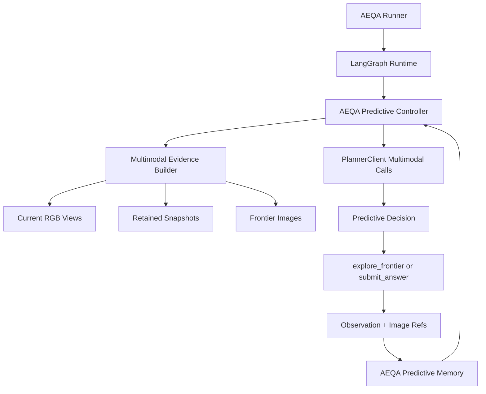

# AEQA Predictive Runtime Demo Design

## Status

Accepted for planning. This spec supersedes the AEQA parts of the earlier runtime designs that assumed the planner prompt is a single rendered text string. The GOATBench runtime path remains unchanged in this first demo.

## Scope

This work is in scope now:

- Build the first demo around AEQA only.
- Port the Pred-EQA style predictive workflow into the LangGraph runtime boundary.
- Send actual RGB observations, retained snapshots, and frontier images to the VLM.
- Keep the planner transport OpenAI-compatible and provider-injected.
- Reduce AEQA runtime tools to `explore_frontier` and `submit_answer`.
- Preserve event logs, prompt audits, memory session ownership, and testability.

This work is out of scope for this demo:

- Reworking GOATBench behavior.
- Implementing full MSGNav KSS, AVU, CLR, or VVD inside GOATBench.
- Running ablations or benchmark sweeps.
- Replacing TSDF, Habitat, GroundingDINO, SAM, CLIP, or existing runner construction.
- Adding extra tools such as seed navigation, object navigation, query memory, or panorama as planner-visible AEQA actions.

## Problem

The current runtime compiles context into text and calls:

```python
messages = [{"role": "user", "content": prompt}]
```

That is enough for GOATBench class-name navigation, but it is structurally wrong for AEQA. AEQA questions often require details that object detectors do not expose, such as object attributes, handles, hanging items, states, and spatial relationships. The VLM must see images, not only `objects_nearby`.

The root issue is not only prompt wording. Runtime contracts, graph state, prompt audit, and planner transport all treat prompt content as `str`, so images are excluded by design.

## Design Goals

- Make AEQA image-first again, matching the core premise of 3D-Mem and Pred-EQA.
- Keep LangGraph as the runtime execution framework, rather than bypassing it with a separate Pred-EQA runner.
- Reuse Pred-EQA prompt structure and parsers where practical.
- Keep the demo small enough to debug: answer from images, explore by frontier, submit answer.
- Keep GOATBench stable while AEQA is rebuilt.

## High-Level Architecture



The runtime keeps the graph lifecycle, but AEQA planning is no longer a single JSON planner call. An AEQA-specific controller performs a bounded Pred-EQA style sequence each round:

1. Build or update the high-level prediction TODO list.
2. Optionally prune retained snapshots when too many exist.
3. Optionally prune frontier candidates when multiple frontiers exist.
4. Ask the answerer whether retained snapshots are enough to answer.
5. If answerable, return `submit_answer`.
6. Otherwise, choose one frontier and return `explore_frontier`.

## Key Decisions

### ADR-001: Use an AEQA Predictive Controller Instead of One Monolithic Planner Prompt

The existing planner asks one model call to choose one JSON action from a text prompt. AEQA needs the Pred-EQA division of responsibility: high-level prediction, evidence management, answer check, and frontier choice. The controller owns this multi-call workflow and returns a normal `PlannerDecision` to the graph.

Alternative rejected: only add images to the existing planner prompt. That would fix transport but preserve the weak reactive planner structure that caused the original design drift.

### ADR-002: Introduce a Multimodal Message Contract

The runtime will distinguish text rendering from model message content. Text sections remain useful for audit and cache boundaries, but planner-facing content may be:

- text blocks,
- `image_url` blocks with `data:image/...;base64,...`,
- mixed OpenAI-compatible content lists.

This should be represented by small Pydantic contracts rather than raw untyped lists. Existing text-only tests should continue through a compatibility path.

### ADR-003: Keep GOATBench on the Current Planner Path for This Demo

GOATBench is not part of the first refactor. The current path recently reached working status and should not be destabilized while AEQA image input is being restored. GOATBench may later consume the same multimodal transport, GD navigation, and hierarchical memory concepts after the AEQA demo is working.

## Component Design

### Multimodal Contracts

Add contracts for planner content blocks:

- `TextContentBlock`: `type="text"`, `text: str`
- `ImageURLContentBlock`: `type="image_url"`, `image_url: {"url": str, "detail": optional str}`
- `PlannerMessage`: `role: str`, `content: str | list[ContentBlock]`

`ContextSection.content` can remain text for audit and hashing, but the compiler/controller must also be able to produce planner messages with image blocks. This avoids forcing image base64 into markdown text.

### Planner Transport

`PlannerClient.call_vlm()` already delegates to `src.agent_workflow.call_vlm`, whose transport can send content lists if messages already contain them. The runtime planner API should accept either:

- text prompt: legacy path,
- full messages: multimodal AEQA path.

`PlannerClient.decide()` should keep the existing text JSON behavior for GOATBench and text-only tests. The AEQA controller can use `call_vlm()` directly for Pred-EQA style prompts and parse their task-specific outputs.

### AEQA Predictive Controller

Add a controller module under `src/tiernav_runtime/` that is runtime-native but reuses Pred-EQA prompt logic:

- high-level plan prompt from `Pred-EQA/src/pred_eqa.py`
- snapshot manager prompt
- frontier manager prompt
- answer prompt
- explore prompt
- TODO extraction from `Pred-EQA/src/plan_extraction_utils.py`

The controller returns a `PlannerDecision`:

- `submit_answer`, arguments `{answer, evidence_snapshot?}`
- `explore_frontier`, arguments `{frontier_id}`

The controller should not import heavy Habitat objects directly. It reads image/evidence payloads through an environment adapter so it remains testable.

### Multimodal Evidence Builder

The environment adapter should expose the current AEQA visual state:

- current egocentric RGB views,
- retained snapshot images,
- frontier images and frontier ids,
- current pose and step index,
- optional high-level plan and memory summaries.

Images are converted with the existing utilities in `src.agent_image_utils` or Pred-EQA's `encode_tensor2base64` logic. The builder must cap image counts so prompts remain bounded:

- retained snapshots: keep all up to 3, then use snapshot manager pruning,
- frontiers: include currently available frontiers after pruning,
- current views: include only the configured current egocentric set.

### AEQA Memory

The first demo needs Pred-EQA style memory, not the full GOATBench hierarchical scene graph:

- current high-level TODO list,
- retained snapshot ids,
- pruned snapshot ids,
- previous step summaries,
- last answerer and planner decisions.

This can live as runtime state or a lightweight session object. It should not replace `MemorySession`; it should be owned by the AEQA controller and surfaced through prompt audit/events.

### Tools

The AEQA visible tool schema should contain only:

- `explore_frontier`: required `frontier_id`
- `submit_answer`: required `answer`

`explore_frontier` continues to call the existing executor-backed frontier navigation. It returns an observation that includes:

- textual progress,
- image ids,
- room id when available,
- raw current image base64 or image refs where available.

`submit_answer` remains terminal and requires a non-empty answer in QA mode.

## Data Flow

### Startup

1. AEQA runner creates `RuntimeEntrypoint.with_real_services(...)`.
2. The entrypoint starts an AEQA per-question memory session.
3. The runtime graph bootstraps `EpisodeState`.

### Each AEQA Planning Round

1. Runtime compiles standard text sections for audit.
2. AEQA predictive controller asks the evidence builder for images and frontier metadata.
3. Controller updates or retrieves the high-level TODO list.
4. Controller asks answerer whether retained snapshots answer the question.
5. If yes, controller returns `submit_answer`.
6. If no, controller asks explorer to select a frontier and returns `explore_frontier`.
7. Runtime policy validates budget and routes to tool execution or finalize.
8. Tool result updates observation and memory.

### Completion

The runtime finalizes through the existing evaluator path. Event logs should record:

- planner/controller calls,
- multimodal prompt audit summaries,
- selected frontier or answer,
- retained/pruned snapshot ids,
- tool results.

## Error Handling

- If a VLM call returns malformed text, retry through the controller-local parser fallback where safe.
- If answerer is malformed, treat as `continue_exploration`.
- If explorer is malformed or selects an invalid frontier, choose the first valid frontier only as a bounded fallback and record `planner_parse_error`.
- If no frontier exists and no answer is available, force answer from retained snapshots if any; otherwise submit `unanswerable`.
- If image extraction fails, continue with text-only context for that round and record the missing image source.
- Do not hide tool failures. Feed the failure summary into the next round.

## Testing Strategy

Targeted tests should cover:

- multimodal content block validation and JSON serialization,
- `PlannerClient.call_vlm()` preserving message content lists,
- AEQA controller parsing answerer and explorer outputs,
- image builder producing OpenAI-compatible content blocks from fake numpy images,
- graph path where AEQA controller returns `submit_answer`,
- graph path where AEQA controller returns `explore_frontier` then `submit_answer`,
- GOATBench text planner compatibility remains intact,
- prompt audit does not write giant base64 blobs unless explicitly configured.

No GPU or Habitat dependency should be required for unit tests. Use fake images and fake environment adapters.

## Affected Files

Expected implementation touch points:

- `src/tiernav_runtime/contracts.py`: multimodal message/content contracts.
- `src/tiernav_runtime/context.py`: text audit remains, optional multimodal render support.
- `src/tiernav_runtime/planner.py`: accept messages/content lists in addition to text prompt.
- `src/tiernav_runtime/graph.py`: route AEQA planning through the predictive controller while preserving GOATBench path.
- `src/tiernav_runtime/entrypoint.py`: wire AEQA controller/environment adapter when task mode is QA.
- `src/tiernav_runtime/tools.py`: provide an AEQA demo registry containing only `explore_frontier` and `submit_answer`.
- `src/tiernav_runtime/recorder.py`: audit multimodal prompts without dumping full base64 by default.
- `src/agent_executor.py`: ensure frontier tool results expose enough image references for AEQA.
- `src/agent_tools.py`: reuse existing frontier navigation and image utilities; avoid new navigation tools.
- `run_two_tier_aeqa_evaluation.py`: select the AEQA predictive runtime path.

Reference-only sources:

- `Pred-EQA/src/pred_eqa.py`
- `Pred-EQA/src/query_vlm.py`
- `Pred-EQA/src/scene_vlm_only.py`
- `Pred-EQA/src/plan_extraction_utils.py`
- `/home/afdsafg/下载/new/3D-Mem/src/agent_workflow.py`

## Acceptance Criteria

- AEQA runtime sends at least one real image block to the VLM in normal operation.
- A fake AEQA graph test can answer a question from a fake snapshot through `submit_answer`.
- A fake AEQA graph test can choose a frontier, execute it, then answer from the next observation.
- GOATBench runtime tests that use text planner decisions still pass.
- Planner prompt audits show text summaries and image metadata, not unbounded base64 payloads.
- The implementation does not add planner-visible AEQA tools beyond `explore_frontier` and `submit_answer`.

## Risks

- Pred-EQA prompts are not JSON-native, so parsers must be tolerant and well tested.
- Multimodal prompts can become too large if snapshots/frontiers are not capped.
- Existing event logs expect JSON-serializable pydantic models; image content must be represented carefully.
- If controller logic is placed directly in graph nodes, tests will become brittle. Keep it behind an injectable controller interface.

## Migration Plan

1. Add multimodal contracts and transport compatibility.
2. Add the AEQA predictive controller with fake-environment tests.
3. Add AEQA demo tool registry.
4. Wire the AEQA runner to the controller.
5. Run targeted runtime tests, then the existing runtime test subset.
6. Only after AEQA demo is stable, start a separate GOATBench hybrid memory/navigation design.
